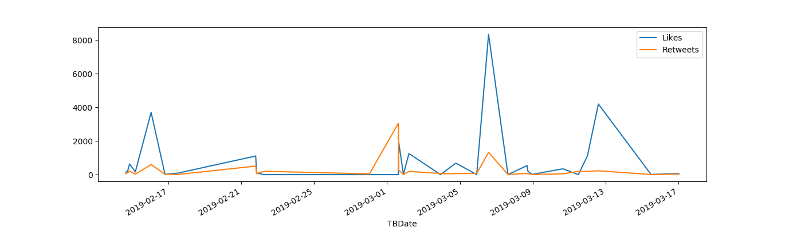

## Priyanka Khanal
### MidTerm Project
### Introduction

Tarana Burke firstly coined the term "MeToo" in 2006. This movement is against sexual harrassment and sexual assault. The main slogan of this movement is "You are not alone" and after the viral #MeToo in social media which was popularized by actress Alyssa Milano in 2017, millions of surviors have come forward with their stories standing together with other surviours. These surviors include famous faces like Actress Ashley Judd, Jennifer Lawerence, Olympic gymnast McKayla Maroney. According to Pew Research, the hastag has been used more that 19 million times around the world.
 
This project has gathered 10,000 most recent tweets with #metoo. Even though this a a global movement, these extracted tweets are only of english language because of limitation of the understanding of other languages.  Then, the tweets were cleaning by removing the username and strings. Any words which are have less than 4 characters were also removed. Those tweets were than used for sentiment analysis.

### Sentiment Analysis
The cleaned tweets were used for sentiment analysis. Out of 10000 tweets, only 36.7% of the tweets were positive where as 14.0% tweets were classified as negative and 49.3% were neutral. 
 

 
The reason behind this might be a lot of these tweets are retweets so mostly neutral.The negative tweets might be people's exeperience where as the positive are the words of encouragement from people. 

### Generating Word Cloud
In this project, word clouds of 100 words were generated from the cleaned tweets to see the buzzwords in the tweets. 
 

 
The words we see in the wordcloud are words like "matters, media, people, abuse, stories". These were not suprising words. But the words that caught the attention were words like "religion, senator, music, scandal". This movement has been very popularized as has touched almost every field possible. Whether it be Republican representative Patrick Meehan or rapper R.Kelly, from Harvey Weinstein to South Korean church pastor. This movement has been helping to investigate against teh accused. 
 
The other intersting thing about the words generated was that there were words like "Gillbrand, Amber Heard, johnny, mcLachlan". Gillbrand probably refers to Senator Kristen Gillbrand who is an advocate of #Metoo movement but was caught in controversy for privately handling sexual assault case in her office. Amber Heard accused actor and ex husband Johnny Deep for sexual assualt as well. mcLachlan is refering to Australian actor Craig McLachlan who was recently accused of sexual assault.

### Popularity
Out of those 10,000 tweets, 10 most retweeted tweets were extracted and highest tweet was retweeted 18342 times. 

## Tarana Burke
 

 
Tarana Burke is the founder of "MeToo movement". She was born in September 12, 1973 in The Bronx, NY. Burke is three-time surviour of sexual assault herself and founded this movement to empathize with young girls to let them know they are not alone. 

### Analysis of tweets
40 recent Tarana Burke tweets were extracted and cleaned. Lexical diversity of Tarana Burke's tweets is 0.74. Word cloud of Tarana Burke's tweets was generated and the words generation in the cloud were "survivors, Permission, finding justice,blasphemy" etc. 
 

 
Time series plot of Likes VS Retweets was also generated. 
 

 

### References
1. https://www.biography.com/people/tarana-burke
2. http://www.pewresearch.org/fact-tank/2018/10/11/how-social-media-users-have-discussed-sexual-harassment-since-metoo-went-viral/ft_18-10-11_metooanniversary_hashtag-used-19m_times/
3. https://www.nytimes.com/2019/01/11/world/australia/craig-mclachlan-indecent-assault.html
4. https://www.thejakartapost.com/life/2019/03/14/the-amber-heard-johnny-depp-domestic-abuse-case-just-got-even-messier-.html
5. https://www.vanityfair.com/news/2019/03/kirsten-gillibrand-abbas-malik-sexual-harassment-me-too

